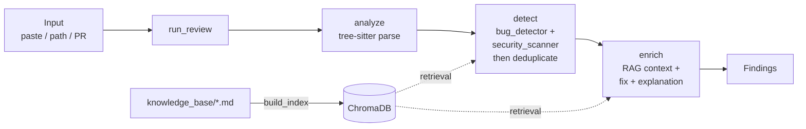

<div align="center">

# 🔍 LLM Code Review Agent

**An AI agent that reviews code for bugs and security vulnerabilities — across five languages — with suggested fixes and plain-English explanations.**

[](https://github.com/Kpole95/llm-code-review-agent/actions/workflows/ci.yml)
[](https://www.python.org/downloads/)
[](LICENSE)

</div>


---

## What it does

Paste a snippet, point it at a local file, or give it a public GitHub pull request URL. The agent reviews the code and returns a list of **findings** — each one a single bug or security vulnerability, with:

- the file and exact line number,
- a severity (`low` · `medium` · `high` · `critical`),
- a category (e.g. `sql_injection`, `hardcoded_secret`, `xss`),
- the original code snippet,
- a suggested fix, and
- a short, plain-English explanation of why it matters and why the fix works.

It supports **Python, JavaScript, TypeScript, Java, and Go**, and grounds its security judgments in a retrieval knowledge base built from OWASP guidance and language best practices.

---

## The problem

Manual code review is slow, inconsistent, and easy to skip under deadline pressure — and the issues that slip through (SQL injection, hardcoded secrets, unsanitized user input) are exactly the expensive ones. Pure static analyzers catch known patterns but miss context and can't explain themselves. This project explores a middle path: an LLM agent that reasons about code in context, grounds its security findings in reference material, suggests concrete fixes, and explains its reasoning the way a senior engineer would in a PR comment.

---

## Key features

- **Five languages** — Python, JavaScript, TypeScript, Java, Go, parsed with tree-sitter.
- **Two-layer detection** — a deterministic regex pass for the highest-confidence issues (hardcoded secrets, `eval`/`exec`) plus an LLM pass for breadth, grounded in OWASP context via RAG.
- **Actionable output** — every finding carries a corrected snippet and an explanation, not just a warning.
- **Schema-guaranteed results** — findings are produced through forced tool-use, so severities and categories always come from a fixed, valid vocabulary.
- **Semantic deduplication** — overlapping detections from the two detectors are merged so you see each real issue once.
- **Three interfaces** — a CLI, a FastAPI service, and a Streamlit web app, all running the same pipeline.
- **Evaluated honestly** — a held-out test set the system was never tuned against, with results reported as a range to reflect LLM variance.
- **Production-shaped** — Dockerized, linted and tested in CI, deployed to AWS ECS via CD, with LangSmith tracing and MLflow experiment tracking.

---

## Demo

### Reviewing pasted code

The web UI renders findings as git-diff-style cards — red for the original, green for the suggested fix — grouped by file and sorted by severity.

| Python | JavaScript |
|:------:|:----------:|
|  |  |

| TypeScript | Java | Go |
|:----------:|:----:|:--:|
|  |  |  |

### Reviewing a GitHub pull request

Give it a PR URL and it pulls every changed file and reviews them together.


### Command line


---

## Architecture

Every interface calls a single function — `run_review(files)` — which executes one compiled **LangGraph** pipeline. There is no duplicated review logic across the CLI, API, and UI.



- **analyze** parses each file's structure (informational; detection runs regardless).
- **detect** runs both detectors on every file, then deduplicates the combined findings — an exact pass on `(file, line, category)` followed by a semantic pass on `category + description` embeddings.
- **enrich** attaches knowledge-base context, generates a fix and an explanation per finding (in parallel across findings), and scrubs any stray HTML before returning.

A deeper write-up — the data contract, the two-detector rationale, and how the design evolved — lives in [`docs/architecture.md`](docs/architecture.md).

---

## Evaluation

The system is scored against a **hold-out set of 10 snippets it was never developed or tuned against**, spanning all five languages and a range of vulnerability categories, including a clean file to check for false positives.

Because the model is non-deterministic, results are reported as a **range across runs** rather than a single cherry-picked number:

| Metric | Range across hold-out runs |
|--------|----------------------------|
| Precision | 0.69 – 0.91 |
| Recall | 0.90 – 1.00 |
| **F1** | **0.78 – 0.95** |

> **Honest caveat:** this is a *controlled* benchmark of short, isolated, single-issue snippets — not a measure of performance on large, messy, real-world codebases. The numbers say the agent reliably handles clean, well-scoped examples; they do **not** claim "95% accuracy on production code." The full run-by-run record, including the variance discussion, is in [`docs/results_history.md`](docs/results_history.md).

The evaluation harness separates a **tuning set** (used while iterating, and therefore optimistically biased) from this hold-out set, and logs every run to MLflow with parameters and metrics for a queryable history.

---

## Tech stack

| Area | Tools |
|------|-------|
| Language / packaging | Python 3.11, [`uv`](https://github.com/astral-sh/uv) |
| Agent pipeline | LangGraph |
| Model | Anthropic Claude (`claude-haiku-4-5`) |
| Parsing | tree-sitter (5 grammars) |
| Retrieval (RAG) | ChromaDB + `all-MiniLM-L6-v2` |
| Interfaces | FastAPI, Streamlit, `rich` CLI |
| Observability | LangSmith (tracing), MLflow on DagsHub (experiments) |
| Infra | Docker, GitHub Actions (CI/CD), AWS ECR + ECS |

---

## Quick start

**Prerequisites:** Python 3.11, [`uv`](https://github.com/astral-sh/uv), and an Anthropic API key. Docker is optional but recommended for running the full stack.

```bash
# 1. Clone and install dependencies
git clone https://github.com/Kpole95/llm-code-review-agent.git
cd llm-code-review-agent
uv sync

# 2. Configure environment
cp .env.example .env
# then edit .env and add your ANTHROPIC_API_KEY

# 3. Build the RAG index
uv run python -m src.rag.build_index

# 4. Run a review from the command line
uv run python -m src.cli review tests/fixtures/sql_injection.py
```

### Run the full stack (API + web UI)

```bash
docker compose up --build
```

Then open the Streamlit UI at **http://localhost:8501** (it talks to the API at **http://localhost:8000**). Paste code or a GitHub PR URL and run a review.

> **Tip:** for GitHub PR mode, set `GITHUB_ACCESS_TOKEN` in `.env` (a classic token with `repo` scope) to raise the GitHub API rate limit from 60 to 5,000 requests/hour.

---

## Usage

**CLI**

```bash
uv run python -m src.cli review path/to/file_or_directory
```

**API**

```bash
curl -X POST http://localhost:8000/review \
  -H "Content-Type: application/json" \
  -d '{"files": [{"path": "x.py", "content": "...", "language": "python"}]}'
```

Interactive API docs are available at `http://localhost:8000/docs`.

**Web UI** — paste code (pick the language) or paste a public GitHub PR URL.

---

## Project structure

```
src/
├── agent/          # LangGraph pipeline, state contract, prompts, LLM client
├── parsing/        # tree-sitter parser + local/GitHub file loaders
├── rag/            # knowledge-base indexing and retrieval
├── tools/          # detectors (bug, security) + enrichers (fix, explain)
├── eval/           # metrics, tuning set, hold-out set, MLflow logging
├── api/            # FastAPI service
└── cli.py          # command-line interface
streamlit_app/      # Streamlit web UI
knowledge_base/     # OWASP + best-practice docs (RAG source — required)
docker/             # Dockerfile
.github/workflows/  # CI (lint + test) and CD (build + deploy)
docs/               # architecture, complete guide, results history
```

---

## CI / CD

- **CI** runs on every push and pull request: `ruff` lint, RAG index build, and the `pytest` suite.
- **CD** runs on push to `main`: it builds the Docker image, pushes it to Amazon ECR (tagged with the commit SHA), and forces a new deployment on AWS ECS.

Deployments use a dedicated, scope-limited IAM user whose credentials live in GitHub Actions secrets, separate from any personal keys.


---

## Known limitations

- **Benchmarked on isolated snippets**, not large multi-file codebases — see the evaluation caveat above.
- **Non-deterministic output** — the same code can yield slightly different findings between runs; this is inherent to LLM-based systems and is why results are reported as a range.
- **Line numbers can occasionally drift** on very large files.
- **No private-repo support** in PR mode without a token; designed around public PRs.
- **Latency scales with finding count** — a highly vulnerable file makes several model calls (mitigated by parallelizing enrichment, but still bounded by the API).

---

## License

Released under the MIT License. See [`LICENSE`](LICENSE).