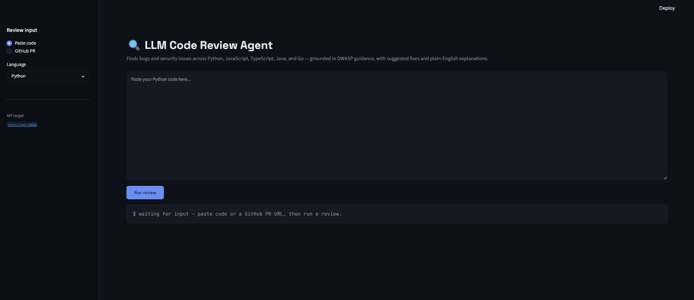
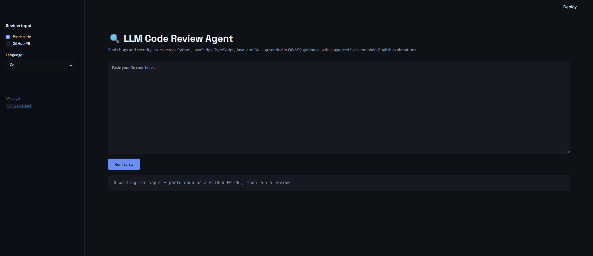
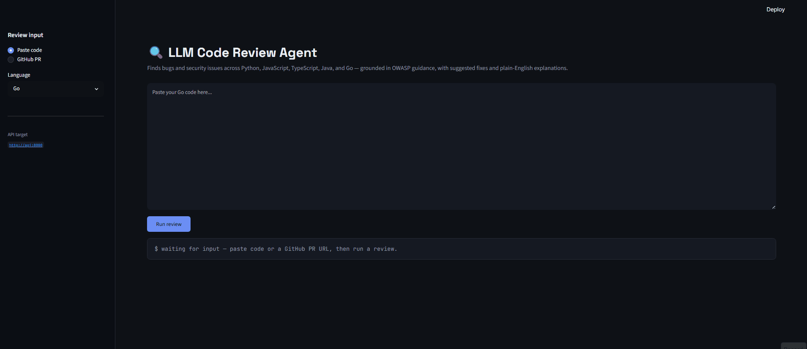
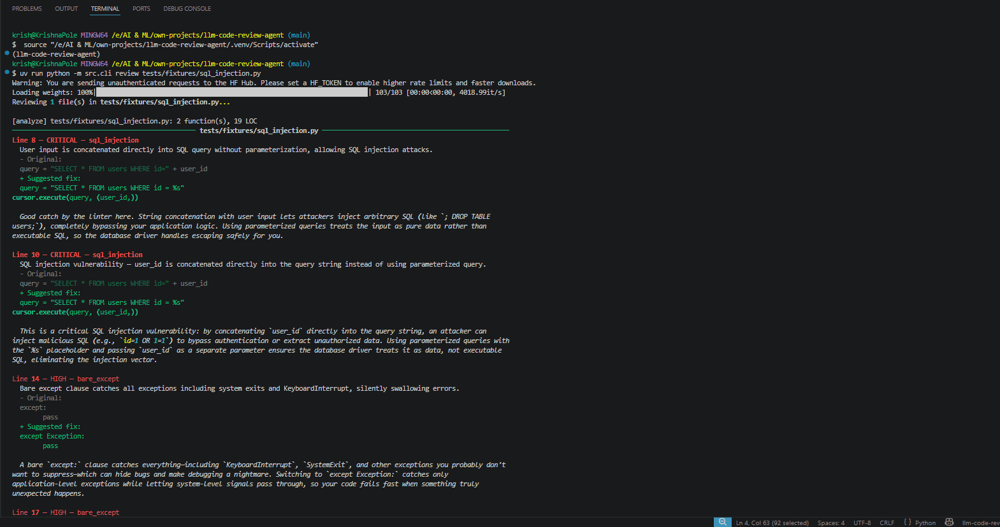
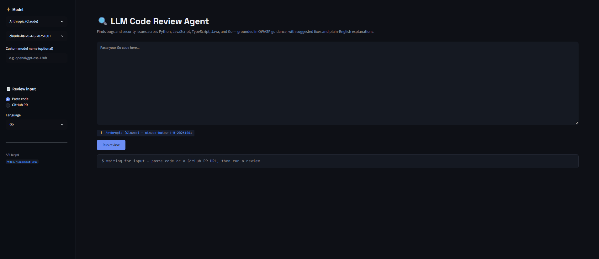
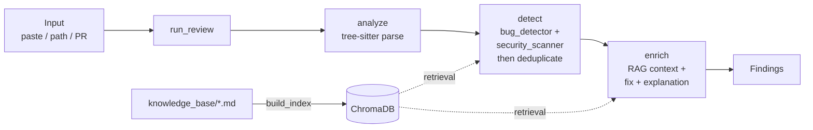
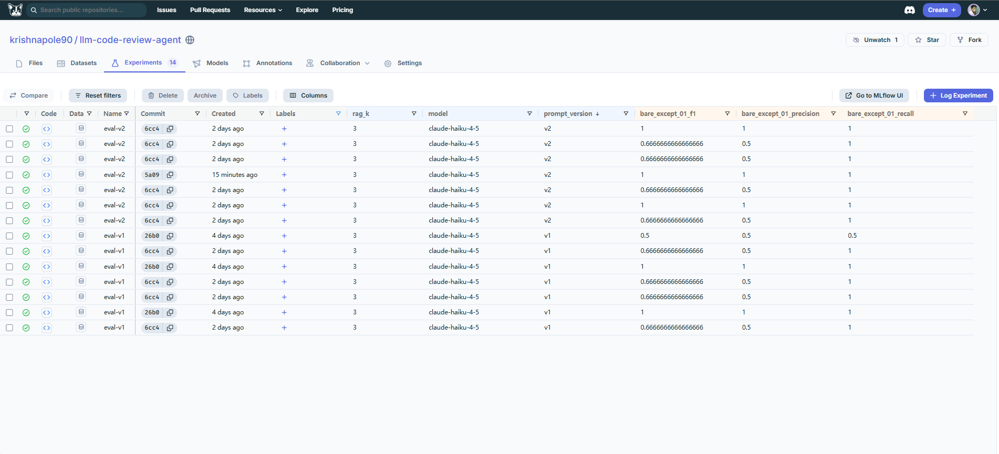
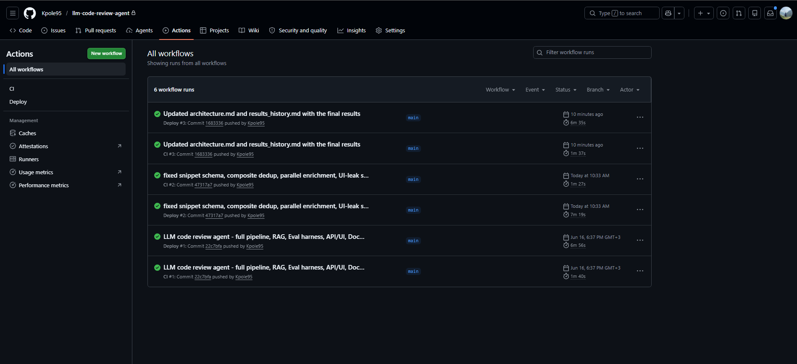
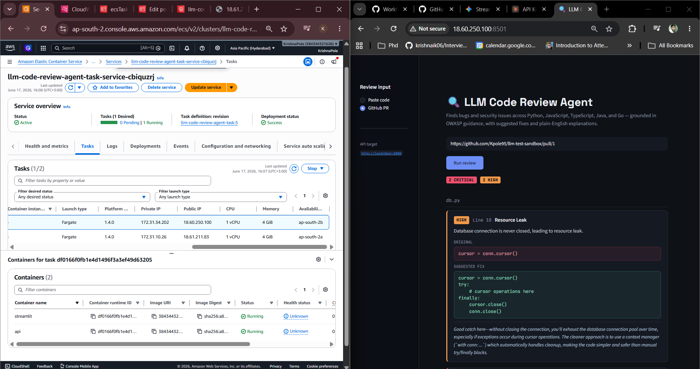

<div align="center">

# 🔍 LLM Code Review Agent

**An AI agent that reviews code for bugs and security vulnerabilities — across five languages — with suggested fixes and plain-English explanations.**

[](https://github.com/Kpole95/llm-code-review-agent/actions/workflows/ci.yml)
[](https://github.com/Kpole95/llm-code-review-agent/actions/workflows/deploy.yml)
[](https://www.python.org/downloads/)
[](LICENSE)
[](https://www.repo-grade.com/report/kpole95/llm-code-review-agent)

</div>



---

## What it does

Paste a snippet, point it at a local file, or give it a public GitHub pull request URL. The agent reviews the code and returns a list of **findings** — each one a single bug or security vulnerability, with:

- the file and exact line number,
- a severity (`low` · `medium` · `high` · `critical`),
- a category (e.g. `sql_injection`, `hardcoded_secret`, `xss`),
- the original code snippet,
- a suggested fix, and
- a short, plain-English explanation of why it matters and why the fix works.

It supports **Python, JavaScript, TypeScript, Java, and Go**, and grounds its security judgments in a retrieval knowledge base built from OWASP guidance and language best practices.

---

## The problem

Manual code review is slow, inconsistent, and easy to skip under deadline pressure — and the issues that slip through (SQL injection, hardcoded secrets, unsanitized user input) are exactly the expensive ones. Pure static analyzers catch known patterns but miss context and can't explain themselves. This project explores a middle path: an LLM agent that reasons about code in context, grounds its security findings in reference material, suggests concrete fixes, and explains its reasoning the way a senior engineer would in a PR comment.

---

## Key features

- **Five languages** — Python, JavaScript, TypeScript, Java, Go, parsed with tree-sitter.
- **Two-layer detection** — a deterministic regex pass for the highest-confidence issues (hardcoded secrets, `eval`/`exec`) plus an LLM pass for breadth, grounded in OWASP context via RAG.
- **Actionable output** — every finding carries a corrected snippet and an explanation, not just a warning.
- **Schema-guaranteed results** — findings are produced through forced tool-use, so severities and categories always come from a fixed, valid vocabulary.
- **Semantic deduplication** — overlapping detections from the two detectors are merged so you see each real issue once.
- **Multi-provider support** — swap the model backend with one line in `.env` or via the Streamlit sidebar — no code changes required.
- **Three interfaces** — a CLI, a FastAPI service, and a Streamlit web app, all running the same pipeline.
- **Evaluated honestly** — a held-out test set the system was never tuned against, with results reported as a range to reflect LLM variance.
- **Production-shaped** — Dockerized, linted and tested in CI, deployed to AWS ECS via CD, with LangSmith tracing and MLflow experiment tracking.

---

## Demo

### Reviewing pasted code

The web UI renders findings as git-diff-style cards — red for the original, green for the suggested fix — grouped by file and sorted by severity.

| Python | JavaScript |
|:------:|:----------:|
|  |  |

| TypeScript | Java | Go |
|:----------:|:----:|:--:|
|  |  |  |

### Reviewing a GitHub pull request

Give it a PR URL and it pulls every changed file and reviews them together.



### Command line

```bash
# default provider from .env
uv run python -m src.cli review path/to/file.py

# switch provider inline
uv run python -m src.cli review path/to/file.py --provider groq
uv run python -m src.cli review path/to/file.py --provider deepseek --model deepseek-coder
```



---

## Multi-provider support

The model backend is swappable — set `MODEL_PROVIDER` in `.env` or pick a provider
from the Streamlit sidebar. The same pipeline, same evaluation harness, and same
output schema work regardless of which model is running underneath.



### Tested providers
...

| Provider | Model | Findings on test snippet | Notes |
|---|---|---|---|
| **Anthropic (Claude)** | claude-haiku-4-5 | 1 CRITICAL + 1 HIGH | Most accurate fix syntax |
| **OpenAI** | gpt-4o-mini | 1 CRITICAL + 1 HIGH | Matches Claude quality |
| **Groq** | openai/gpt-oss-120b | 1 CRITICAL + 2 HIGH | Fast (500 t/s), free tier |
| **DeepSeek** | deepseek-coder | 2 CRITICAL | Missed resource leak, duplicate SQL finding |
| **Gemini** | gemini-2.0-flash | — | Supported, not benchmarked |
| **Ollama** | qwen2.5-coder:7b | Varies | Local/private; GPU strongly recommended |

> Tested against an identical SQL injection + resource leak snippet across all providers. Claude and OpenAI were most precise. Groq (GPT-OSS-120B) matched them and is the fastest. DeepSeek is cheapest but missed one vulnerability category in this test.

### Switching providers

**In `.env`:**
```bash
MODEL_PROVIDER=groq           # or anthropic | openai | deepseek | gemini | ollama
GROQ_API_KEY=gsk_...
GROQ_MODEL=openai/gpt-oss-120b
```

**In the Streamlit UI:** use the provider and model dropdowns in the sidebar — no restart needed.

**In the CLI:**
```bash
uv run python -m src.cli review file.py --provider groq --model openai/gpt-oss-120b
```

### Groq model IDs

| Model ID | Speed | Best for |
|---|---|---|
| `openai/gpt-oss-120b` | 500 t/s | Best quality, reasoning |
| `openai/gpt-oss-20b` | 1000 t/s | Fastest, cheapest |
| `llama-3.3-70b-versatile` | 280 t/s | Strong general model |
| `llama-3.1-8b-instant` | 560 t/s | Free tier, ultra fast |
| `qwen/qwen3.6-27b` | 500 t/s | Alibaba, vision capable |

### Local model support (Ollama)

Set `MODEL_PROVIDER=ollama` to run entirely on your machine — no API calls, no cost, code never leaves your infrastructure:

```bash
ollama pull qwen2.5-coder:7b
```

```bash
MODEL_PROVIDER=ollama
OLLAMA_MODEL=qwen2.5-coder:7b
```

> **Note:** CPU inference is 2–8 minutes per file. A GPU or a cloud-hosted open-source provider (Groq, Together.ai) is strongly recommended for practical use. The Ollama backend also supports any self-hosted OpenAI-compatible endpoint for enterprise private deployments.

---

## Architecture

Every interface calls a single function — `run_review(files)` — which executes one compiled **LangGraph** pipeline. There is no duplicated review logic across the CLI, API, and UI.



- **analyze** parses each file's structure (informational; detection runs regardless).
- **detect** runs both detectors on every file, then deduplicates the combined findings — an exact pass on `(file, line, category)` followed by a semantic pass on `category + description` embeddings.
- **enrich** attaches knowledge-base context, generates a fix and an explanation per finding (in parallel across findings), and scrubs any stray HTML before returning.

A deeper write-up lives in the `docs/` folder:
[`architecture.md`](docs/architecture.md) · [`design.md`](docs/design.md) · [`PRD.md`](docs/PRD.md) · [`Phases.md`](docs/Phases.md) · [`rules.md`](docs/rules.md)

---

## Evaluation

The system is scored against a **hold-out set of 10 snippets it was never developed or tuned against**, spanning all five languages and a range of vulnerability categories, including a clean file to check for false positives.

Because the model is non-deterministic, results are reported as a **range across runs** rather than a single cherry-picked number:

| Metric | Range across hold-out runs |
|--------|----------------------------|
| Precision | 0.69 – 0.91 |
| Recall | 0.90 – 1.00 |
| **F1** | **0.78 – 0.95** |

> **Honest caveat:** this is a *controlled* benchmark of short, isolated, single-issue snippets — not a measure of performance on large, messy, real-world codebases. The numbers say the agent reliably handles clean, well-scoped examples; they do **not** claim "95% accuracy on production code." The full run-by-run record is in [`docs/results_history.md`](docs/results_history.md).

### Experiment tracking

Every evaluation run is logged to **MLflow** (hosted on **DagsHub**) with its parameters (prompt version, model, RAG `k`) and metrics (precision, recall, F1, plus per-snippet breakdowns).



> Note: the runs shown are logged against the tuning set used during iteration, so their scores run higher than the honest hold-out range above.

---

## Tech stack

| Area | Tools |
|------|-------|
| Language / packaging | Python 3.11, [`uv`](https://github.com/astral-sh/uv) |
| Agent pipeline | LangGraph |
| Model providers | Anthropic Claude, OpenAI, Groq, DeepSeek, Gemini, Ollama |
| Default model | `claude-haiku-4-5` (Anthropic) |
| Parsing | tree-sitter (5 grammars) |
| Retrieval (RAG) | ChromaDB + `all-MiniLM-L6-v2` |
| Interfaces | FastAPI, Streamlit, `rich` CLI |
| Observability | LangSmith (tracing), MLflow on DagsHub (experiments) |
| Infra | Docker, GitHub Actions (CI/CD), AWS ECR + ECS Fargate |

---

## Quick start

**Prerequisites:** Python 3.11, [`uv`](https://github.com/astral-sh/uv), and an API key for your chosen provider.

```bash
# 1. Clone and install dependencies
git clone https://github.com/Kpole95/llm-code-review-agent.git
cd llm-code-review-agent
uv sync

# 2. Configure environment
cp .env.example .env
# edit .env — set MODEL_PROVIDER and the matching API key

# 3. Build the RAG index
uv run python -m src.rag.build_index

# 4. Run a review from the command line
uv run python -m src.cli review tests/fixtures/sql_injection.py
```

### Run the full stack (API + web UI)

```bash
docker compose up --build
```

Then open the Streamlit UI at **http://localhost:8501**. Use the sidebar to pick your provider and model, then paste code or a GitHub PR URL and run a review.

> **Tip:** for GitHub PR mode, set `GITHUB_ACCESS_TOKEN` in `.env` (a classic token with `repo` scope) to raise the GitHub API rate limit from 60 to 5,000 requests/hour.

---

## Usage

**CLI**

```bash
# review a file with the default provider
uv run python -m src.cli review path/to/file_or_directory

# switch provider inline
uv run python -m src.cli review file.py --provider groq
uv run python -m src.cli review file.py --provider openai --model gpt-4o
uv run python -m src.cli review file.py --provider deepseek --model deepseek-coder
```

**API**

```bash
curl -X POST http://localhost:8000/review \
  -H "Content-Type: application/json" \
  -d '{"files": [{"path": "x.py", "content": "...", "language": "python"}]}'
```

Interactive API docs at `http://localhost:8000/docs`.

**Web UI** — use the provider/model dropdowns in the sidebar, then paste code or a GitHub PR URL.

---

## Project structure

```
src/
├── agent/          # LangGraph pipeline, state contract, prompts, LLM client
├── parsing/        # tree-sitter parser + local/GitHub file loaders
├── rag/            # knowledge-base indexing and retrieval
├── tools/          # detectors (bug, security) + enrichers (fix, explain)
├── eval/           # metrics, tuning set, hold-out set, MLflow logging
├── api/            # FastAPI service
└── cli.py          # command-line interface
streamlit_app/      # Streamlit web UI
knowledge_base/     # OWASP + best-practice docs (RAG source — required)
docker/             # Dockerfile
scripts/            # benchmark and utility scripts
.github/workflows/  # CI (lint + test) and CD (build + deploy)
docs/               # architecture, design, PRD, phases, rules, results history
```

---

## CI / CD

- **CI** runs on every push and pull request: `ruff` lint, RAG index build, and the `pytest` suite.
- **CD** runs on push to `main`: builds the Docker image, pushes to Amazon ECR (tagged with the commit SHA), and forces a new deployment on AWS ECS.



---

## Deployment

The application is containerized and deployed on **AWS ECS (Fargate)** — a single task running two containers (the FastAPI API and the Streamlit UI) from an image in **Amazon ECR**. The CD pipeline builds and ships a new image on every push to `main`.



> The service is scaled to zero when idle to avoid running costs. It can be spun up on demand by scaling the ECS service to one task.

---

## Known limitations

- **Benchmarked on isolated snippets**, not large multi-file codebases — see the evaluation caveat above.
- **Non-deterministic output** — the same code can yield slightly different findings between runs; results are reported as a range for this reason.
- **Line numbers can occasionally drift** on very large files.
- **No private-repo support** in PR mode without a token; designed around public PRs.
- **Local model quality varies** — Ollama backend works but quality depends heavily on the chosen model; GPU strongly recommended over CPU.

---

## License

Released under the MIT License. See [`LICENSE`](LICENSE).